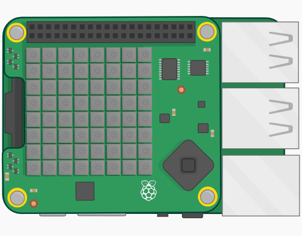

# SnakeGame_RaspberryPi_SenseHat
This python script runs a Snake Game on the Raspberry Pi Sense Hat.

### Installation
There is no installation required. Just download the **snake.py**-file and run it.

### Requirements
Raspberry Pi & Sense Hat or the [Sense Hat Emulator](https://trinket.io/sense-hat)

### Author
**Daniel Duller** - [dadul96](https://github.com/dadul96)

### License
This project is licensed under the MIT License - see the [LICENSE](LICENSE) file for details.
